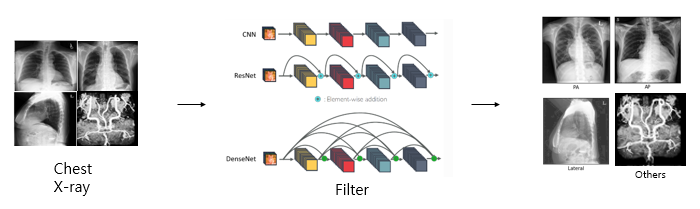

# PA, AP, Lateral, Others Classification

<p align="center">
    
</p>

* Filter model (resnet, densensenet, efficientnet) was used to classify into PA, AP, Lateral, and Others through chest X-ray data.

* Learning data is conducted using AMC (AsanMedicalCenter) 25,700 CXR Image, CheXpert 19,800 CXR Image, and MIMIC-CXR 19,800 CXR Image.

* Improve the accuracy of the algorithm by using bagging ensemble technique.

* Accuracy is 98%, showing that model performance is very excellent.

## **Requirements**
* tensorflow 2.0.0
* matplotlib 3.3.4
* SimpleITK 1.2.4
```python
%cd Test
!pip install -r 'requirements.txt'
```
## **How can we use ?**
- The example code below applies to almost all modules.

### **Inference**
```python
%cd Test
!python run_main.py -i './input_data' -gpu -1
```                 
* i: Input cxr image folder location.
* gpu: Please enter the gpu number you will use
  
The output results are saved as a csv file in the location corresponding to parameter i.

## **Reference**
MIMIC CXR: https://physionet.org/content/mimic-cxr/2.0.0/

CheXpert: https://aimi.stanford.edu/chexpert-chest-x-rays

## **Contributing**
If you'd like to contribute, or have any suggestions for these guidelines, you can contact us at junegoo.lee@gmail.com or open an issue on this GitHub repository.